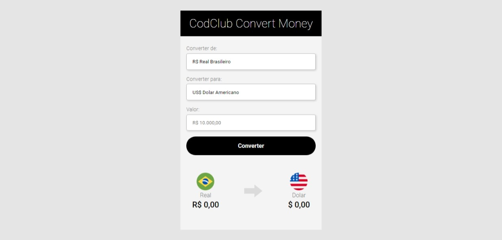
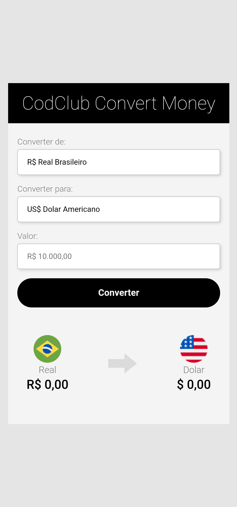

# Converte Money React

> Nesse projeto fiz um conversor de moedas utilizando o React || In this project I made a currency converter using React

### Ajustes e melhorias

O projeto ainda está em desenvolvimento e as próximas atualizações serão voltadas nas seguintes tarefas:

- [x] Idealização
- [x] Estrutura
- [x] Estilização
- [x] Responsividade
- [ ] JS

## Feito Com:

## 🤝 Criador

Projeto feito integralmente por: 

<table>
  <tr>
    <td align="center">
      <a href="https://github.com/yolmat">
         
        
          <b>Mateus Saraiva</b>
        
      </a>
    </td>
  </tr>
</table>

Copyright © 2022 yolmat

